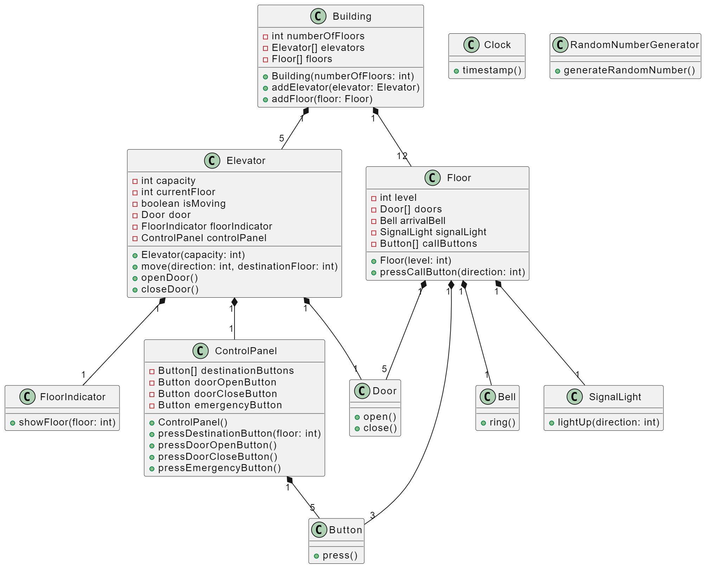

# Elevator Management System UML :gem:

---

## UML Diagram

---

Design a class diagram based on the following problem statement.

Try to use Object-Oriented Programming principles and relationships between classes (Encapsulation, Inheritance, Polymorphism, Abstraction).

Kodluyoruz Insurance Company wants to construct a 12-story office building and equip it with the latest elevator technology. The company wants you to create a software simulator that models the operations of the building's elevators to see if they meet the traffic flow needs within the building.

The building will have five elevators, each capable of servicing all 12 floors of the building. Each elevator has a capacity of approximately six adult passengers. The elevators are designed to be energy efficient, so they only move when necessary. Each elevator has its own door, floor indicator light, and control panel. The control panel includes destination buttons, door open and close buttons, and an emergency signal button.

On each floor of the building, there is a door for each of the five elevator shafts and an arrival bell for each door. The arrival bell indicates that an elevator has arrived at a floor. A signal light located above each door indicates the arrival of an elevator and the direction in which the elevator is moving. Each floor also has three sets of elevator call buttons.

A person calls an elevator by pressing the appropriate call button (up or down). A dispatcher assigns one of the five elevators to go to the floor where the call originated. After entering the elevator, a passenger typically presses one or more destination buttons. As the elevator moves from floor to floor, an indicator light inside the elevator informs passengers of the elevator's position. The arrival of an elevator at a floor is signaled by the lighting of the indicator light above the outside elevator door and the sounding of the floor bell. When an elevator stops at a floor, both sets of doors automatically open for a preset amount of time, allowing passengers to enter and exit the elevator.

The simulator uses a "clock" to simulate real-time passage and to timestamp and log events occurring in the simulation. A random number generator is used to create passengers and to determine departure and arrival floors for each passenger.

