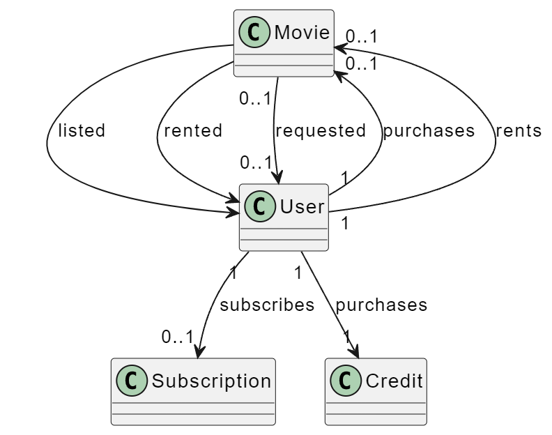

# Film Management System UML :gem:

Design a system for an application that sells or rents movies online.

Movies can be listed, sorted, and users can subscribe to the application.
Users purchase credits through the system for their subscriptions.
Only subscribed users can rent movies using their credits, and the rental cost in credits is deducted from their account.
Both regular users and subscribers can purchase movies.
If a movie is not available, it can be requested.
Draw a class diagram depicting this system.

---

## UML Diagram

