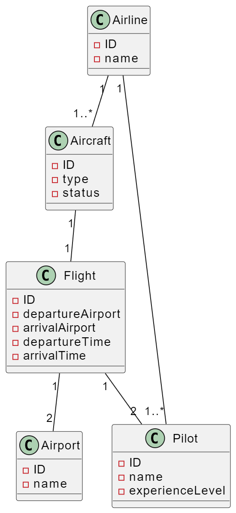

# Flight Management System :gem:

Design a system for the management of flights and pilots.

Airline companies operate flights. Each airline has an ID.
The airline company owns different types of aircraft.
Aircraft can be either operational or under maintenance.
Each flight has a unique ID, departure and arrival airports, and departure and arrival times.
Each flight has a pilot and a co-pilot who operate the aircraft.
Airports have unique IDs and names.
Airline companies have pilots, and each pilot has a level of experience.
An aircraft type may require a certain number of pilots.
Draw a class diagram depicting this system.

---

## UML Diagram

