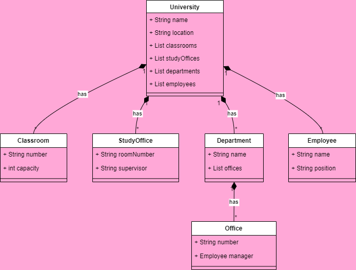

# University Management System :gem:

1- There are classrooms, study offices, and departments belonging to the university.

2- There are offices belonging to the departments.

3- There are employees belonging to the university. These employees can be professors or clerks.

4- Each employee works in an office.

---

## UML Diyagramı

