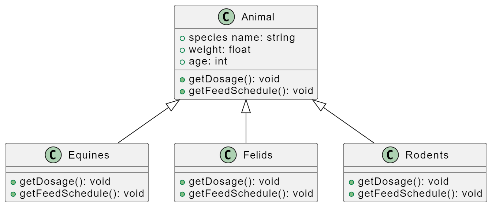

# Zoo Management System UML :gem:

A system to track information about animals in a zoo.

Animals:
Characterized by species in groups such as:

Equines (horses, zebras, donkeys, etc.),
Felids (tigers, lions, etc.),
Rodents (rats, beavers, etc.).
Most of the information stored about the animals is the same across all groupings:

species name, weight, age, etc.
The system must also be able to:

Get the dosage of specific medications for each animal => getDosage()
Calculate feeding schedules for each animal => getFeedSchedule()
The logic for performing these functions will differ for each grouping. For instance, the feeding algorithm for horses will be different from that for tigers.

Design a class diagram to address the situation described above using the polymorphism model.

---

## UML Diagram

